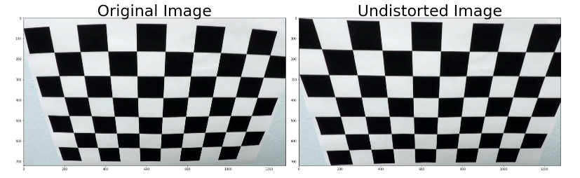
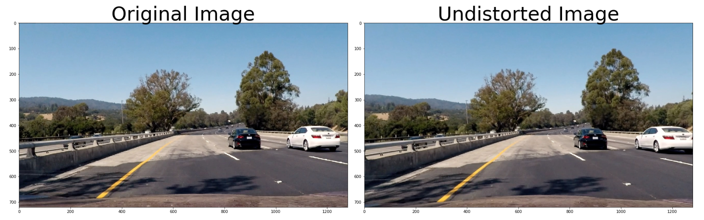
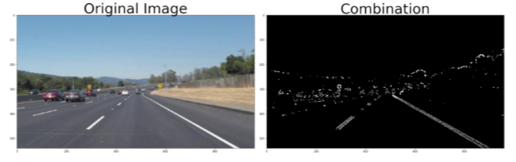
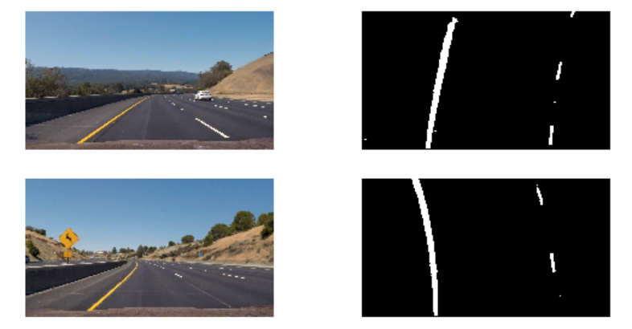
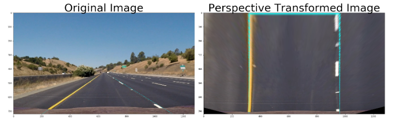
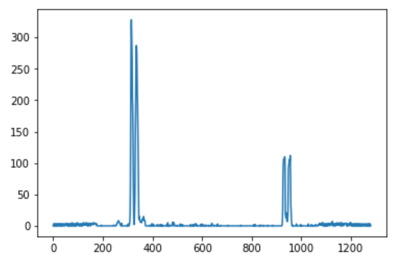
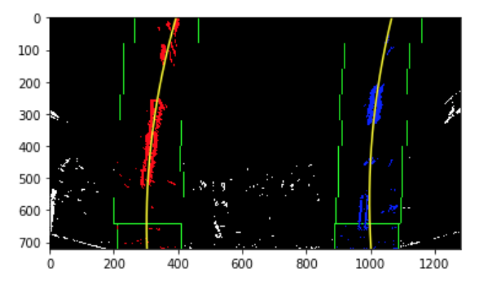
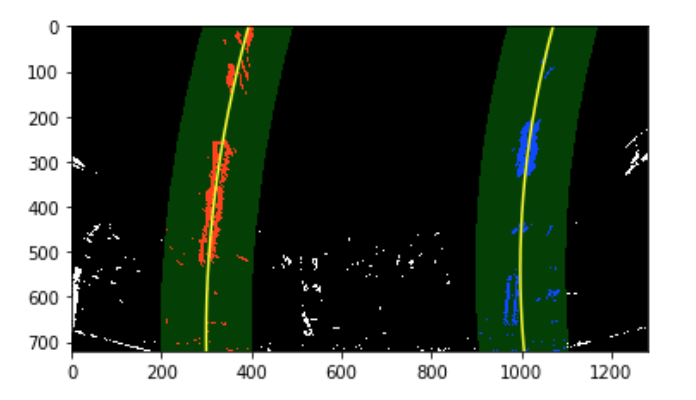
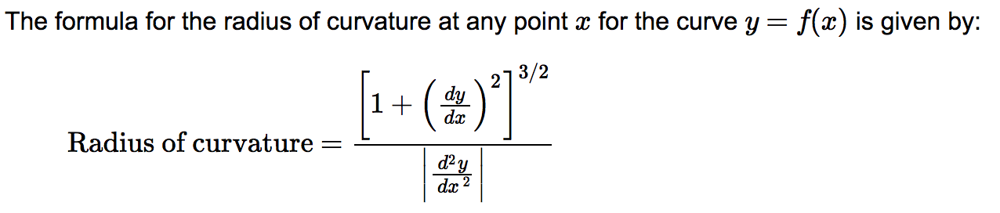
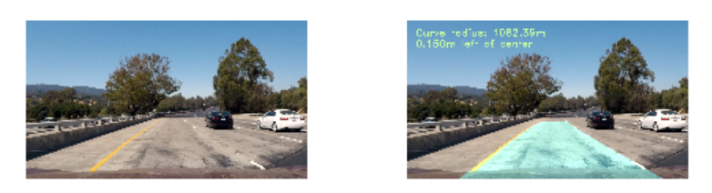

## **Advanced Lane Finding Project**

The goals / steps of this project are the following:

* Compute the camera calibration matrix and distortion coefficients given a set of chessboard images.
* Apply a distortion correction to raw images.
* Use color transforms, gradients, etc., to create a thresholded binary image.
* Apply a perspective transform to rectify binary image ("birds-eye view").
* Detect lane pixels and fit to find the lane boundary.
* Determine the curvature of the lane and vehicle position with respect to center.
* Warp the detected lane boundaries back onto the original image.
* Output visual display of the lane boundaries and numerical estimation of lane curvature and vehicle position.

[//]: # (Image References)

[image1]: ./examples/undistort_output.png "Undistorted"
[image2]: ./test_images/test1.jpg "Road Transformed"
[image3]: ./examples/binary_combo_example.jpg "Binary Example"
[image4]: ./examples/warped_straight_lines.jpg "Warp Example"
[image5]: ./examples/color_fit_lines.jpg "Fit Visual"
[image6]: ./examples/example_output.jpg "Output"
[video1]: ./project_video.mp4 "Video"

## [Rubric](https://review.udacity.com/#!/rubrics/571/view) Points

### Here I will consider the rubric points individually and describe how I addressed each point in my implementation.  

---

### Writeup / README

#### 1. Provide a Writeup / README that includes all the rubric points and how you addressed each one.  You can submit your writeup as markdown or pdf.  [Here](https://github.com/udacity/CarND-Advanced-Lane-Lines/blob/master/writeup_template.md) is a template writeup for this project you can use as a guide and a starting point.  


### Camera Calibration

#### 1. Briefly state how you computed the camera matrix and distortion coefficients. Provide an example of a distortion corrected calibration image.

The code for this step is contained in the first code cell of the IPython notebook located in "./examples/example.ipynb"

I start by preparing "object points", which will be the (x, y, z) coordinates of the chessboard corners in the world. Here I am assuming the chessboard is fixed on the (x, y) plane at z=0, such that the object points are the same for each calibration image.  Thus, `objp` is just a replicated array of coordinates, and `objpoints` will be appended with a copy of it every time I successfully detect all chessboard corners in a test image.  `imgpoints` will be appended with the (x, y) pixel position of each of the corners in the image plane with each successful chessboard detection.  

I then used the output `objpoints` and `imgpoints` to compute the camera calibration and distortion coefficients using the `cv2.calibrateCamera()` function.  I applied this distortion correction to the test image using the `cv2.undistort()` function and obtained this result:




### Pipeline (single images)

#### 1. Provide an example of a distortion-corrected image.

The image below shows the results of applying undistortion to one of the project dashcam images. `cv2.undistort` was used to implement the distortion correction by using the calculated camera matrix and distortion coefficient.

#### 2. Describe how (and identify where in your code) you used color transforms, gradients or other methods to create a thresholded binary image.  Provide an example of a binary image result.

I used a combination of color and gradient thresholds to generate a binary image (The code for this step is contained in the second section of the IPython notebook located in "./examples/advanced_lane_finding.ipynb").  Here's an example of my output for this step.  



I tried different combination of threshold methods, including x&y  gradient, magnitude of the gradient, gradient direction and HLS color space and LAB color space. The results shows L of the HLS color works very positive on recognising white lane line, and B of LAB color has advantage on recognising yellow lane line. Attched picture is an example of output combining L and B color threshold methods.




#### 3. Describe how (and identify where in your code) you performed a perspective transform and provide an example of a transformed image.

The code for my perspective transform was presented at section 3 of the file(./examples/advanced_lane_finding.ipynb).  The perspective takes image as inputs, as well as source (`src`) and destination (`dst`) points.  I chose the hardcode the source(ROI) and destination points in the following manner:

```python
src = np.float32(
    [[(img_size[0] / 2) - 60, img_size[1] / 2 + 100],
    [((img_size[0] / 6) - 10), img_size[1]],
    [(img_size[0] * 5 / 6) + 60, img_size[1]],
    [(img_size[0] / 2 + 65), img_size[1] / 2 + 100]])
dst = np.float32(
    [[(img_size[0] / 4), 0],
    [(img_size[0] / 4), img_size[1]],
    [(img_size[0] * 3 / 4), img_size[1]],
    [(img_size[0] * 3 / 4), 0]])
```

This resulted in the following source and destination points:

| Source        | Destination   |
|:-------------:|:-------------:|
| 580, 460      | 320, 0        |
| 203, 720      | 320, 720      |
| 1126, 720     | 960, 720      |
| 705, 460      | 960, 0        |

I verified that my perspective transform was working as expected by drawing the `src` and `dst` points onto a test image and its warped counterpart to verify that the lines appear parallel in the warped image.



#### 4. Describe how (and identify where in your code) you identified lane-line pixels and fit their positions with a polynomial?

The code of this part was implemented at section 4 of the file(./examples/advanced_lane_finding.ipynb).

There were two processes implemented to identify lane line pixels. One was used at the start of the processing, which no previous lane lay was identified, another one was used at the following part of the processing, which was designed to save computation power.

Process 1:
- Take a histogram along all the columns in the lower half of the binary image, it will normally show a likely result as shown on the following figure. Find the peaks of left and right half of the histogram. Those will be the start point of left and right lane lines.

- Considering the interest of the lane lines, ROI window processing was used. The number of windows can be pre-defined. In thes case I used 9 windows. The first pair of windows (one for left and another one for right) was placed at the start points calculated by previous step. Identify the nonzero pixels in x and y within the window. Then, recenter next window on their mean position.
- Concatenate the arrays of indices from 9 pairs of windows. Extract left and right line pixel positions from indices. At last, fit a second order polynomial to each lane line.


Process 2:
When line pixels were identified, the following lines become easy to find. The concept is to scan the last lane line area with pre-defined margin. Lane line pixels were identified within those areas. Then fit a second order polynomial.



#### 5. Describe how (and identify where in your code) you calculated the radius of curvature of the lane and the position of the vehicle with respect to center.

The code of this part was implemented at section 5 of the file(./examples/advanced_lane_finding.ipynb).

- Define conversions in x and y from pixels space to meters
- Fit new polynomials to x,y in world space
- Calculate the new radii of curvature (reference: https://www.intmath.com/applications-differentiation/8-radius-curvature.php)

- Assuming the camera is mounted at the center of the vehicle. Car_position = middle of image
- Calculate the position of the vehicle with respect to center of lane lines.


#### 6. Provide an example image of your result plotted back down onto the road such that the lane area is identified clearly.

The code of this part was implemented at section 6 of the file(./examples/advanced_lane_finding.ipynb).

Here is an example of my result on a test image:



---

### Pipeline (video)

#### 1. Provide a link to your final video output.  Your pipeline should perform reasonably well on the entire project video (wobbly lines are ok but no catastrophic failures that would cause the car to drive off the road!).

The code of pipeline was implemented at section 7 of the file(./examples/advanced_lane_finding.ipynb).

Here's a link to my final video output: [project_video_output.mp4 ](./project_video_output.mp4)


---

### Discussion

#### 1. Briefly discuss any problems / issues you faced in your implementation of this project.  Where will your pipeline likely fail?  What could you do to make it more robust?

1. Road conditions are complexity. Illumination of the image and the contract between lane line and others are easily changed, but it highly effects the performance of lane line identification. With the conditions like tree shadows and wet road or passing-by white cars, the algorithm may easily meet wrong identifications.
  - Solution: Use previous images and previous results of lane lines to increase the robustness of the current identification . Use the feature of lane line. It is a smooth curve, which has continuous derivatives. Self-adaptive threshold may also improve the robustness.
2. No lane line detected, or only one side of lane line is detected.
  - Solution: During the programming, design a state to deal with this situation. Consider to 'relax' thresholds to re-identify the lane line.
